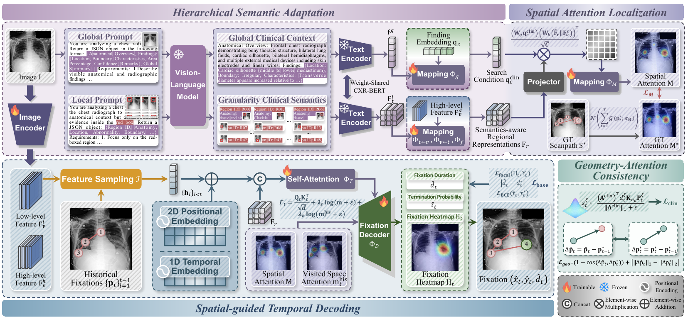
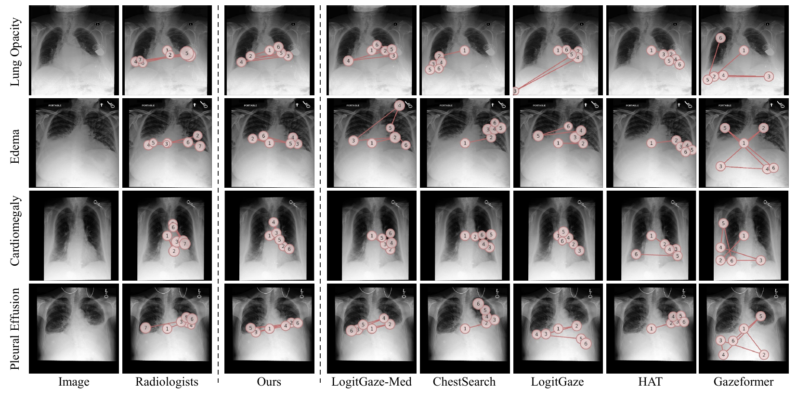

# HiSTAR: Hierarchical Semantic-Aware Spatio-Temporal Decoding with Vision-Language Models for Radiology Scanpath Prediction

HiSTAR is a radiology scanpath prediction framework that combines hierarchical clinical semantics, task-relevant spatial localization, and progressive temporal decoding.



**HiSTAR overview.** Hierarchical Semantic Adaptation incorporates global context and granularity semantics to construct image-specific search conditions and semantics-aware regional representations. Spatial-guided Temporal Decoding estimates a task-relevant spatial prior for progressive trajectory generation, while Geometry-Attention Consistency regularizes attention allocation and inter-fixation geometry.

## Abstract

Radiology scanpath prediction aims to model the dynamic visual search behavior of radiologists during task-specific diagnostic reasoning. However, abnormalities in radiological images often exhibit low contrast and subtle visual manifestations, requiring joint reasoning over anatomical structures and local abnormal findings. Accurate scanpath prediction further requires modeling spatial localization, temporal dependencies, and fixation geometry, posing substantial challenges to existing methods. Recent medical vision-language models have demonstrated strong capabilities in medical image understanding, providing rich clinical context beyond visual representations alone. Motivated by these advances, we propose HiSTAR, a Hierarchical Semantic-Aware Spatio-Temporal Decoding framework for radiology scanpath prediction. HiSTAR first introduces Hierarchical Semantic Adaptation to incorporate global and fine-grained clinical semantics, yielding an image-specific diagnostic search condition and semantics-aware regional representations. Spatial-guided Temporal Decoding then estimates a task-relevant spatial attention distribution and leverages the resulting spatial prior to guide progressive trajectory generation. Finally, Geometry-Attention Consistency jointly regularizes task-relevant attention allocation and inter-fixation geometry to promote diagnostically relevant and spatially coherent scanpaths. HiSTAR achieves state-of-the-art performance on the GazeSearch benchmark. Downstream disease classification on SIIM-ACR and TB-MOUSE further demonstrates that HiSTAR-predicted gaze provides effective task-relevant information for medical image analysis.

## Qualitative Visualization



**Predicted scanpaths on GazeSearch.** HiSTAR concentrates fixations on diagnostically relevant regions and produces transitions that more closely follow radiologist scanpaths than the comparison methods.

## Repository Structure

```text
HiSTAR/
├── Data/
│   ├── Text/<image-id>/
│   │   ├── global.json
│   │   └── local.json
│   ├── dataset.py
│   └── finding_visual_search_..._shuffled.json
├── method/
│   ├── model/
│   ├── utils/
│   ├── dataset_gaze.py
│   ├── train.py
│   └── test.py
├── assets/
├── requirements.txt
└── README.md
```

## Data Preparation

### Dataset Links

The datasets used in our experiments can be accessed from the following sources:

* **GazeSearch**: [Official Repository](https://github.com/UARK-AICV/GazeSearch) | [Hugging Face Dataset](https://huggingface.co/datasets/phamtrongthang/GazeSearch)
* **SIIM-ACR Pneumothorax Segmentation**: [Kaggle Dataset](https://www.kaggle.com/c/siim-acr-pneumothorax-segmentation/data)

The original GazeSearch split annotation and the global/local clinical descriptions are included under `Data`. The global and local clinical text descriptions used by HiSTAR can also be downloaded from [Google Drive](https://drive.google.com/drive/folders/1itARcZuYHQi3JsVJ3S3g-t7t_5V4sSd1?usp=sharing) and should be placed under:

```text
Data/Text/
```

Download the GazeSearch images separately and retain the filenames used by the annotation file:

```text
Data/images/
```

> **Note:** Part of the GazeSearch image data is derived from MIMIC-CXR. Access to the corresponding images may therefore require authorized access to MIMIC-CXR through PhysioNet.

Clinical descriptions are encoded lazily with `microsoft/BiomedVLP-CXR-BERT-specialized`. The model is downloaded on first use unless `--text-model` points to a local model directory. Finding-specific attention supervision is reconstructed only from records belonging to the active split.

## Installation

Python 3.10 or later is recommended.

```bash
pip install -r requirements.txt
```

## Training

Run commands from the `HiSTAR` directory:

```bash
python method/train.py
```

Only the training split is passed to the optimizer. The validation split is used for validation loss, checkpoint selection, learning-rate scheduling, and early stopping. The test split is not loaded by the training entry point.

Useful options include:

## Evaluation

Evaluate the held-out test split with:

```bash
python method/test.py \
  --data-root Data \
  --checkpoint method/output/experiment_TIMESTAMP/checkpoint_best.pth \
  --split test
```

The evaluation script reports the ScanMatch, MultiMatch, SED, and STDE metrics and writes predictions, per-sample measurements, attention maps, and scanpath visualizations to the checkpoint directory or the directory specified by `--output-dir`.

